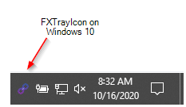

# FXTrayIcon

[](https://search.maven.org/search?q=g:%22com.dustinredmond.fxtrayicon%22%20AND%20a:%22FXTrayIcon%22)
[](https://travis-ci.com/dustinkredmond/FXTrayIcon)

Library intended for use in JavaFX applications that makes adding a System Tray icon easier.
The FXTrayIcon class translates JavaFX MenuItems into AWT MenuItems, so no need to import anything
from the AWT package. This is particularly useful because JavaFX does not provide a way to add a 
System Tray icon in their API. 

Check out the [sample application](./src/test/java/com/dustinredmond/fxtrayicon/IconTest.java) in the test directory for an example of how this works. 

---

## Usage

From within your JavaFX application, adding a tray icon is as simple as two lines of code.
Yes, really, that's it!

```java
// Pass in the app's main stage, and path to the icon image
FXTrayIcon icon = new FXTrayIcon(stage, getClass().getResource("someImageFile.png"));
icon.show();
```

---

## How do I add to my project 

The project is available as a Maven dependency on Central. Add the following to POM.xml

```xml
<dependency>
  <groupId>com.dustinredmond.fxtrayicon</groupId>
  <artifactId>FXTrayIcon</artifactId>
  <version><!--See Below --></version>
</dependency>
```

Or, if using Gradle to build, add the below to your Gradle build file

```groovy
compile group: 'com.dustinredmond.fxtrayicon', name: 'FXTrayIcon', version: '<see below>'
```

You can even use it from a Groovy script!

```groovy
@Grapes(
  @Grab(group='com.dustinredmond.fxtrayicon', module='FXTrayIcon', version='<see below>')
)
```

*Note, for the current stable version number, use the following:*
[](https://search.maven.org/search?q=g:%22com.dustinredmond.fxtrayicon%22%20AND%20a:%22FXTrayIcon%22)

---

## Screenshots



An example of FXTrayIcon running on Windows 10, of course, you choose your own icon file.
Here we used a link icon from [Icons8](https://www.icons8.com), they provide thousands of amazing
 icons for developers, both free (with an attribution) and paid.


An example of FXTrayIcon's custom context menu, built using JavaFX MenuItems.
Surprise, surprise, JavaFX MenuItems get translated into AWT MenuItems by FXTrayIcon,
so there's no need to use those!

---

## Supported operating systems

Any operating system that supports system tray icons.

Call `FXTrayIcon.isSupported()` to see if the current platform
supports the system tray.
